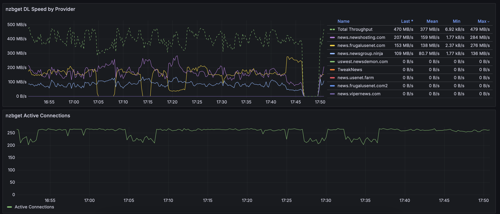

[hub]: https://hub.docker.com/r/frebib/nzbget-exporter
[git]: https://github.com/frebib/nzbget-exporter
[drone]: https://drone.spritsail.io/frebib/nzbget-exporter
[mbdg]: https://microbadger.com/images/frebib/nzbget-exporter

# NZBGet Exporter

[][drone]
[][git]
[][mbdg]
[][hub]

A Prometheus-style exporter for NZBGet metrics and statistics via the NZBGet API. It does what it says on the tin!

### Important notice
NZBGet has an [unsigned integer bug](https://github.com/nzbget/nzbget/issues/693) that causes this exporter to return 500 errors. It has been [fixed in NZBGet v21.1 and newer](https://github.com/nzbget/nzbget/commit/a124a91a84d3221dea25d7f5bb51a837ff75183a). It is adviseable to use the latest version of NZBGet with this exporter, otherwise you may experience large periods of time with no metrics.

## Getting Started

Build from source
```sh
git clone https://github.com/frebib/nzbget-exporter.git .
go install github.com/frebib/enumerx@latest
go generate
go build -o nzbget_exporter
./nzbget_exporter --help
```

Run with Docker
```sh
docker run -t \
  -e NZBGET_HOST=http://nzbget:6789 \
  -e NZBGET_USERNAME=nzbget \
  -e NZBGET_PASSWORD=tegbzn6789 \
  -p 9452:9452 \
  frebib/nzbget-exporter
```

Run with docker-compose
```yaml
services:
  nzbget_exporter:
    image: frebib/nzbget-exporter
    tty: true
    environment:
    - NZBGET_HOST=http://nzbget:6789
    - NZBGET_USERNAME=nzbget
    - NZBGET_PASSWORD=tegbzn6789
    ports:
    - 9452:9452
```

## Configuration Options

Configuration should be passed via command-line arguments, or the environment. Every option is described in the `--help` output, as below:
```
Usage:
  nzbget-exporter [OPTIONS]

Options:
      --log-level= log verbosity level (trace, debug, info, warn, error, fatal) (default: info) [$LOG_LEVEL]
      --namespace= metric name prefix (default: nzbget) [$NZBGET_METRIC_NAMESPACE]
  -l, --listen=    host:port to listen on (default: :9452) [$NZBGET_LISTEN]
  -h, --host=      nzbget host to export metrics for [$NZBGET_HOST]
  -u, --username=  nzbget username for basicauth [$NZBGET_USERNAME]
  -p, --password=  nzbget password for basicauth [$NZBGET_PASSWORD]

Help Options:
  -h, --help       Show this help message
```

## Grafana Dashboard
An example grafana starter dashboard is included in the grafana directory.


